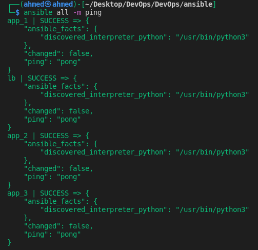

# Continuous Deployment

## Table of Contents

1. Overview

   1.1. Ansible

2. Goal

3. Steps

   3.1. Connecting to VMs

   3.2. 

## Overview

### Ansible

- A **playbook** (written in YAML) defines one or more **tasks/plays** (each expressed as list of **modules**) that will be executed on one or more remote machines (selected from **inventory**) through an SSH connection (no agent required).
- A **play** has a **name** (optional), target **hosts** (selected by **patterns**), and a **remote_user** (e.g., root).
- An **inventory** (YAML/INI file) contains [named groups of] IP addresses or hostnames of remote machines, it can also store **variables**.
- **Modules** (**[built-in](https://docs.ansible.com/ansible/2.9/modules/modules_by_category.html)** or [**3rd-party**](https://galaxy.ansible.com/)) are small units of code that Ansible executes against remote machines (default **strategy** is sequential).
- Ansible collects **return codes** from executed tasks, **facts** about remote machines and **magic variables** storing internal state.
- **Role: **the standard way to group related Ansible artifacts (vars, files, tasks, etc.) to share them so they can be loaded and reused.

## Goal

Getting familiar with Ansible by:

- Writing a play that automatically installs docker on Linux hosts.
- Executing the play on Vagrant VMs created during the previous phase. 

## Steps

### Prerequisites

- [Install Ansible CLI](https://docs.ansible.com/ansible/latest/installation_guide/intro_installation.html)

- Apply terraform plan with vagrant provider from previous phase.

  ```bash
  cd terraform/vagrant
  terraform apply
  ```

- Get SSH ports and private keys for connecting to the VMs.

  ```bash
  terraform state show vagrant_vm.vagrantbox
  ```

- Create inventory (`ansible/inventory.ini`) with configuration for connecting to VMs.

- Create project configuration (`ansible/ansible.cfg`) and override inventory file location.

- Run an `ssh-agent` then add private keys using `ssh-add <key_file>`

  - Alternatively, specify `ansible_ssh_private_key_file=<key_file>` in inventory (key files should be ignored from VCS).

- Test connection with `ping` module

  

## Installing docker on VMs 

- Install 3rd party docker role: `ansible-galaxy install geerlingguy.docker`

- Create a playbook that uses the installed role (`ansible/main.yml`)

- Execute the playbook: `ansible-playbook ansible/main.yml`

  

- Verify that docker is installed

  


## Best Practices

- A module should be responsible for one small task.

- Use `ansible-playbook --check` to check syntactic errors.

- Use `ansible-lint` to lint playbooks.

- Recommended directory structure:

  ```
  playbooks
  ├── playbook_name.yml
  └── roles
      └── role_name
          ├── defaults
          ├── files
          ├── handlers
          ├── library
          ├── mets
          ├── tasks
          ├── templates
          └── vars
  ```

  
